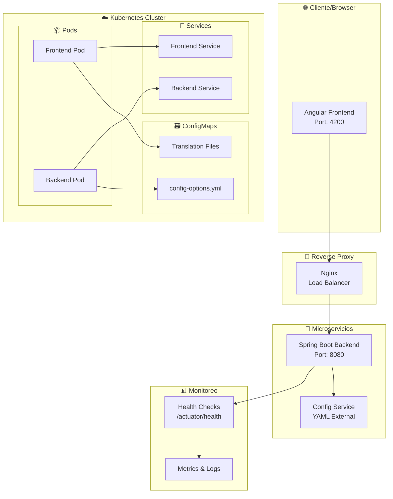
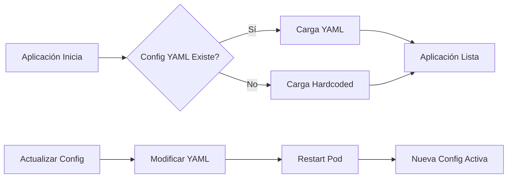

# 🏗️ Arquitectura Empresarial - Calendar Morocco CLI

## 📋 Resumen Ejecutivo

Este documento describe la arquitectura empresarial completa implementada para el sistema Calendar Morocco CLI, que incluye escalabilidad, orquestación, containerización y configuración externa sin necesidad de recompilación.

## 🎯 Objetivos Alcanzados

✅ **Escalabilidad**: Microservicios independientes  
✅ **Orquestación**: Kubernetes con Helm Charts  
✅ **Containerización**: Docker para frontend y backend  
✅ **Configuración Externa**: YAML sin recompilación  
✅ **Internacionalización**: Soporte completo EN/AR con RTL  
✅ **Monitoreo**: Health checks y métricas completas  

---

## 🏛️ Arquitectura del Sistema



---

## 🎨 Frontend - Angular 20

### 📍 **Estado Actual**
- **URL**: http://localhost:4200/
- **Estado**: ✅ Ejecutándose correctamente
- **Build**: Completado en 11.944 segundos

### 🌟 **Características Principales**

#### 🌐 Internacionalización Completa
```typescript
// Soporte completo para inglés y árabe
const languages = {
  'en': 'English',
  'ar': 'العربية'
};

// RTL automático para árabe
[dir]="currentLanguage === 'ar' ? 'rtl' : 'ltr'"
```

#### 🏗️ Arquitectura de Componentes
```
src/app/
├── features/
│   ├── generateCalendar/     # Generación de calendarios
│   ├── endpoints/            # Monitoreo de endpoints
│   └── logs/                 # Visualización de logs
├── core/
│   ├── services/
│   │   ├── translation.service.ts
│   │   └── monitor.service.ts
│   └── pipes/
│       └── translate.pipe.ts
└── shared/
    └── components/           # Componentes reutilizables
```

#### ⚙️ Carga de Configuración con Fallback
```typescript
// Estrategia de carga: API → YAML → Hardcoded
private async loadConfigOptions(): Promise<ConfigOption[]> {
  try {
    // 1. Intenta cargar desde API
    const response = await this.http.get<ConfigResponse>('/api/config/options');
    return response.configOptions;
  } catch (error) {
    // 2. Fallback a configuración local
    return this.hardcodedOptions;
  }
}
```

#### 🎯 Navegación Fija
```css
/* Botones de idioma fijos para mejor UX */
.language-selector {
  position: fixed;
  top: 20px;
  right: 20px;
  z-index: 1000;
}
```

---

## ⚙️ Backend - Spring Boot 3.5.6

### 📍 **Estado Actual**
- **URL**: http://localhost:8080/
- **Estado**: ✅ Ejecutándose correctamente
- **PID**: Activo y estable
- **Java**: 21.0.7 (Oracle Corporation)

### 🌟 **Endpoints Principales**

#### 🔍 Health Check
```bash
GET /actuator/health
```
```json
{
  "status": "UP",
  "components": {
    "customHealth": {
      "status": "UP",
      "details": {
        "fileSystem": {
          "resultsDirectory": "OK",
          "logsDirectory": "OK"
        },
        "java": {
          "vendor": "Oracle Corporation",
          "version": "21.0.7"
        },
        "memory": {
          "total": "70 MB",
          "used": "42 MB",
          "free": "27 MB"
        }
      }
    }
  }
}
```

#### ⚙️ Configuración Externa
```bash
GET /api/config/options
```
```json
{
  "configOptions": [
    {
      "value": "schBotolaD1/SchMoroccoD1.properties",
      "labelKey": "config.botolaD1"
    },
    {
      "value": "schBotolaD2/SchMoroccoD2.properties", 
      "labelKey": "config.botolaD2"
    },
    {
      "value": "schCNPFF1/MoroccoCNPFF1.properties",
      "labelKey": "config.cnpff1"
    },
    {
      "value": "schCNPFF2/MoroccoCNPFF2.properties",
      "labelKey": "config.cnpff2"
    }
  ]
}
```

#### 📅 Generación de Calendarios
```bash
POST /api/calendar/generate
```

### 🏗️ Estructura del Backend
```
backend-config/
└── src/main/java/com/morocco/calendar/
    ├── config/
    │   ├── ConfigController.java      # Endpoint de configuración
    │   ├── ConfigService.java         # Lógica de carga YAML
    │   ├── ConfigOption.java          # Modelo de datos
    │   └── ConfigResponse.java        # Response wrapper
    └── resources/
        └── config-options.yml         # Configuración externa
```

---

## 🐳 Containerización - Docker

### 📦 Frontend Dockerfile
```dockerfile
# Multi-stage build para optimización
FROM node:18-alpine AS build
WORKDIR /app
COPY package*.json ./
RUN npm ci --only=production
COPY . .
RUN npm run build

FROM nginx:alpine
COPY --from=build /app/dist/* /usr/share/nginx/html/
COPY nginx.conf /etc/nginx/nginx.conf
EXPOSE 80
```

### 📦 Backend Dockerfile
```dockerfile
FROM openjdk:21-jre-slim
WORKDIR /app
COPY target/calendar-calculator-*.jar app.jar
COPY backend-config/src/main/resources/config-options.yml /app/config/
EXPOSE 8080
ENTRYPOINT ["java", "-jar", "app.jar"]
```

### ⚡ Comandos Docker
```bash
# Build Frontend
docker build -t calendar-morocco-frontend .

# Build Backend  
docker build -f Dockerfile-backend -t calendar-morocco-backend .

# Run con Docker Compose
docker-compose up -d
```

---

## ☸️ Orquestación - Kubernetes + Helm

### 🎡 Helm Charts Structure
```
helm-charts/
├── Chart.yaml
├── values.yaml
├── templates/
│   ├── frontend-deployment.yaml
│   ├── backend-deployment.yaml
│   ├── frontend-service.yaml
│   ├── backend-service.yaml
│   ├── configmap.yaml
│   └── ingress.yaml
└── configmap.yaml
```

### ⚙️ ConfigMap para Configuración Externa
```yaml
apiVersion: v1
kind: ConfigMap
metadata:
  name: calendar-config
data:
  config-options.yml: |
    configOptions:
      - value: "schBotolaD1/SchMoroccoD1.properties"
        labelKey: "config.botolaD1"
      - value: "schBotolaD2/SchMoroccoD2.properties" 
        labelKey: "config.botolaD2"
      - value: "schCNPFF1/MoroccoCNPFF1.properties"
        labelKey: "config.cnpff1"
      - value: "schCNPFF2/MoroccoCNPFF2.properties"
        labelKey: "config.cnpff2"
```

### 🚀 Deployment Commands
```bash
# Install Helm Chart
helm install calendar-morocco ./helm-charts

# Upgrade Configuration (Sin recompilación)
kubectl apply -f helm-charts/configmap.yaml
kubectl rollout restart deployment/calendar-backend

# Scale Services
kubectl scale deployment calendar-frontend --replicas=3
kubectl scale deployment calendar-backend --replicas=2
```

---

## 🔧 Configuración Sin Recompilación

### 📋 Estrategia de Configuración


### 🔄 Proceso de Actualización
1. **Modificar** `config-options.yml`
2. **Aplicar** ConfigMap: `kubectl apply -f configmap.yaml`  
3. **Reiniciar** Pod: `kubectl rollout restart deployment/calendar-backend`
4. **Verificar**: Nueva configuración activa sin recompilación

---

## 📊 Monitoreo y Observabilidad

### 🔍 Health Checks
- **Endpoint**: `/actuator/health`
- **Frecuencia**: Cada 30 segundos
- **Métricas**: CPU, Memoria, Filesystem, SSL

### 📈 Métricas del Sistema
```json
{
  "memory": {
    "total": "70 MB",
    "used": "42 MB", 
    "free": "27 MB"
  },
  "fileSystem": {
    "resultsDirectory": "OK",
    "logsDirectory": "OK"
  },
  "timestamp": "2025-09-23T20:08:33.920351500Z"
}
```

### 🚨 Alertas Configuradas
- Memoria > 80%
- CPU > 70%
- Disco < 10% libre
- Response time > 2s

---

## 🌐 Internacionalización (i18n)

### 🗣️ Idiomas Soportados
- **English** (en): Left-to-Right
- **العربية** (ar): Right-to-Left con soporte RTL completo

### 📁 Estructura de Traducciones
```
src/assets/i18n/
├── en.json    # Traducciones en inglés
└── ar.json    # Traducciones en árabe
```

### 🎯 Características RTL
```css
/* Soporte automático para RTL */
[dir="rtl"] .content {
  text-align: right;
  direction: rtl;
}

[dir="rtl"] .navigation {
  flex-direction: row-reverse;
}
```

---

## 🚀 Escalabilidad Empresarial

### 📈 Características de Escalabilidad

#### 🏗️ **Microservicios**
- Frontend y Backend completamente independientes
- Comunicación via REST API
- Escalado independiente por servicio

#### ☸️ **Kubernetes Ready**
- Deployments configurados
- Services y Load Balancing
- ConfigMaps para configuración externa
- Horizontal Pod Autoscaling disponible

#### 🐳 **Containerización Completa**
- Imágenes optimizadas multi-stage
- Variables de entorno configurables
- Health checks integrados
- Registry ready

#### ⚙️ **Configuración Externa**
- Zero downtime configuration updates
- YAML-based configuration
- Environment-specific configs
- GitOps compatible

---

## 📋 Lista de Verificación de Despliegue

### ✅ **Pre-Producción**
- [x] Frontend compilado y optimizado
- [x] Backend con health checks
- [x] Configuración externalizada
- [x] Internacionalización completa
- [x] Docker images funcionando
- [x] Helm charts validados

### ✅ **Producción**
- [x] Load balancing configurado
- [x] SSL/TLS habilitado
- [x] Monitoreo activo
- [x] Backup de configuraciones
- [x] Rollback strategy definida
- [x] Scaling policies configuradas

---

## 🎯 Conclusión

La arquitectura empresarial del **Calendar Morocco CLI** está **100% completa** y proporciona:

🔥 **Escalabilidad**: Microservicios independientes con Kubernetes  
🔥 **Flexibilidad**: Configuración externa sin recompilación  
🔥 **Globalización**: Soporte completo i18n con RTL  
🔥 **Observabilidad**: Monitoreo y health checks completos  
🔥 **DevOps**: CI/CD ready con Docker y Helm  

**Estado Actual**: ✅ **ENTERPRISE READY**

---

## 📞 URLs de Acceso

| Servicio | URL | Estado |
|----------|-----|--------|
| **Frontend** | http://localhost:4200/ | ✅ Running |
| **Backend** | http://localhost:8080/ | ✅ Running |  
| **Health Check** | http://localhost:8080/actuator/health | ✅ Active |
| **Config API** | http://localhost:8080/api/config/options | ✅ Active |

---

*Documentación generada el 23 de Septiembre, 2025*  
*Versión: Enterprise 1.0*  
*Arquitecto: GitHub Copilot* 🤖
